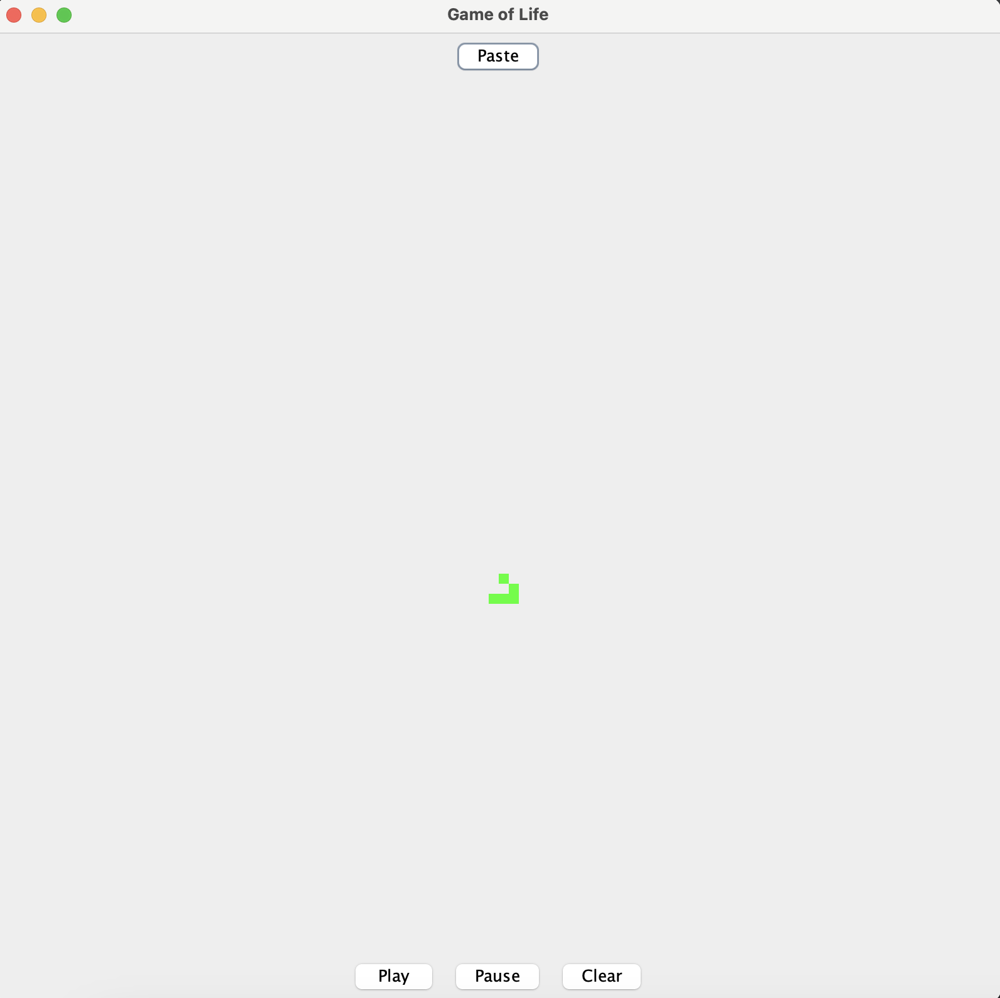

# Conway's Game of Life Project

This project uses an interactive GUI to mimic Conway's Game of Life.

The "Play" button plays the next generation every second, showing which cells are alive and which aren't. The "Pause" button pauses the game, and the "Clear" button restarts it.

